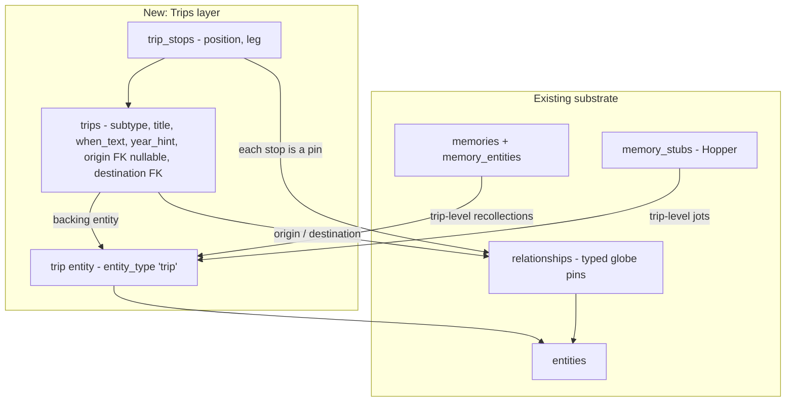

# Trips & Travel Journal - Plan

## Goal Capsule

- **Objective:** Make travel a first-class strand of the chronicle: Trips as structured objects (origin → ordered stops → distinct destination) layered over existing globe pins, destination-only Trip drafts as a core novice workflow, a toggleable trip-route layer on the globe, and a Travel Journal mode alongside the Residential Journey.
- **Authority hierarchy:** Project invariants in `CLAUDE.md` (Raw Vault immutability, no date parsing, additive-migration safety gate) override this plan; this plan overrides the origin brainstorm transcript where they conflict (conflicts are recorded as KTDs below).
- **Stop conditions:** Any migration that alters or drops existing data → stop and get Andy's approval (safety gate). Any product-scope change beyond the Requirements below → ask Andy, don't improvise.
- **Execution profile:** Slice-by-slice on `main` (project convention), one unit ≈ one shippable slice with its own proof and QA checklist; Andy proofs the live dev server per slice.

---

## Product Contract

### Summary

Build the Trips & Travel track agreed in the 2026-07-15 Codex brainstorm, mapped onto this instance's existing substrate: six typed pins with anchoring, the Journey surface, and the Hopper. The new build is the Trip object and its draft lifecycle, the destination-first creation flow, the globe route layer, the Travel Journal mode, retroactive trip framing for existing pins, the frequent-traveler package, the Future Places pin type, and unsequenced residences (spine pins embellishable before they join the sequence).

### Problem Frame

Perusing the globe triggers recollections of places visited — Winnipeg for a convention, Scotland for the clan homelands — but the current model can only store a *point*: a typed marker with a dashed tether to a home. A journey has shape the point can't express (origin, itinerary, turnaround, return), and for users with a stable residential spine, travel is the primary carrier of geographic richness, not an annotation on residences. Two capture postures must both work: the deliberate chronicler framing a complete trip, and the novice dropping destination pins around the globe as a travel skeleton for later definition — possibly before any residential spine exists.

The origin brainstorm was held against the Codex instance, which lacks upfront pin-type designation. This instance already has that (six pin types, type selector in PinModal, generalized Log anchoring — `docs/plans/2026-06-12-globe-place-types-design.md`), so this plan starts at the Trip layer, not the pin-type layer.

### Requirements

**Trip object**

- R1. A Trip is a first-class chronicle object with subtype (Professional, Vacation, Road trip), title, free-text timeframe, an optional origin, a required destination, and an ordered itinerary of intermediate stops split around the destination as turnaround divider (origin → outbound stops → destination → return stops → origin).
- R2. Trip origin, destination, and stops are globe pins; repeat visits reuse the geographic place entity while remaining distinct Trips with their own dates, purpose, itinerary, and recollections.
- R3. A residence association supplies temporal context ("home at the time") but never makes a Trip part of the residential sequence; a Trip with no residence association is fully valid.
- R4. A Trip carries its own recollections and jots, at trip level and at stop level.

**Draft lifecycle (novice workflow, not an edge case)**

- R5. Dropping a destination pin and choosing Trip is enough to save — no origin, itinerary, subtype, timeframe, or residential spine required.
- R6. A destination-only draft is visibly incomplete ("needs framing") on the globe and in the Travel Journal; no route arc renders without an origin.
- R7. Deferred completion: the user can later confirm an origin, associate a residence period, add ordered stops, and complete the Trip.

**Creation flow**

- R8. Trip creation is destination-first: drop the destination pin → choose Trip + subtype → confirm destination name/location → confirm origin (suggested: the residence active around that time; alternatives: another existing pin, a new pin, decide later) → frame title/timeframe → optionally add ordered stops in a route-building mode → save.
- R9. Origin → destination is sufficient to save a framed (non-draft) Trip.

**Globe**

- R10. Trip route arcs are a separate layer, hidden by default, so the residential spine stays visually dominant; a toggle reveals them, and the selected or in-edit trip always shows its complete route.
- R11. A trip destination renders as a visually distinct marker, distinguishable from the origin, from itinerary stops, and from existing point markers.

**Travel Journal**

- R12. Journey gains two modes — Residential Journey (existing) and Travel Journal — with trips organized chronologically, independent of residential periods.
- R13. Travel Journal trip cards expand to show subtype, timeframe, origin → destination, itinerary, and recollections; drafts surface with a completion affordance.

**Retroactive framing & Logs**

- R14. An existing non-primary pin (Vacation, Professional travel, Log) can be retroactively framed as a Trip destination without losing its identity, tether, recollections, or jots — and unframed: deleting the trip preserves the pin and restores its pre-trip state.
- R15. A Log may attach to a residence, a Trip, or a Trip stop, or remain standalone and be linked later (stop-level attachment rides the stop's pin).

**Unsequenced residences**

- R21. A primary residence pin can be created without a position in the spine sequence ("decide later"): fully embellishable (narrative, photos, facts, jots), visibly not-yet-placed, and excluded from the spine thread and all spine-derived logic until the user places it in sequence.
- R22. A trip origin can be an unsequenced residence — the origin may not yet exist in the residential spine, and confirming it must not force a spine insertion.

**Frequent traveler**

- R16. A user can designate a Home Base residence that new trips suggest as origin automatically.
- R17. Shortcuts: "create another trip from this origin" and "reuse this destination."
- R18. Travel Journal filters: subtype and timeframe (transport mode deferred).
- R19. A residence card summarizes rather than enumerates its trips ("N trips originated here"), linking into the Travel Journal.

**Future Places**

- R20. A forward-looking pin type for places the user wants to visit or relocate to — visually distinct from all historical pins and explicitly distinct from destination-only Trip drafts (aspiration vs. unframed history).

### Acceptance Examples

- AE1. **Winnipeg (draft capture).** Browsing North America, the user drops a pin on the Winnipeg convention center, picks Trip → Professional, and saves with nothing else. The globe shows a distinct destination marker flagged as needing framing; no arc renders. Later they confirm the origin residence and the trip completes. Covers R5–R8.
- AE2. **Scotland 1960 (retroactive framing).** The existing `vacationed_at` pin "Memorial Castle of Sir William Wallace" (when "1960", tethered to RAF Mildenhall) is framed as a Trip: RAF Mildenhall suggested and confirmed as origin, the monument becomes the destination, and the Moffat/lowlands visit — today only prose in the recollection — is added as an itinerary stop. The pin keeps its identity, tether, recollection, and jots. Covers R1, R2, R8, R14.
- AE3. **Round trip with turnaround.** For New Hampshire → Utah → New Hampshire, the user marks Utah as the destination (the turnaround) and the trip returns to origin; outbound and return stops order around the destination divider in one itinerary. Covers R1, R9.
- AE4. **Spine dominance.** With twelve trips saved, the default globe view shows the residential spine and point markers exactly as today; enabling the Trips toggle reveals route arcs; selecting one trip shows its complete route even with the toggle off. Covers R10, R11.
- AE5. **Origin before the spine.** While framing a trip, the user picks "add an origin pin" for a home not yet on the globe. A residence pin is created without a spine position: the spine thread and its order are unchanged, the pin shows a not-yet-placed treatment, and the trip's origin is set. Later the user places it in sequence and it joins the thread at the chosen position. Covers R21, R22, R8.

### Scope Boundaries

**Outside this product's identity**

- GPS route reconstruction, exact road geometry, turn-by-turn tracking.
- Booking, itinerary management, expenses, or travel planning.
- Parsing `when_text` into dates (Temporal Agent territory, invariant #5).

**Deferred to Follow-Up Work**

- Wide-zoom destination clustering / visit counts instead of overlapping spokes (revisit when a real account has dozens of trips).
- Transport-mode capture and filter.
- Trip-aware synthesis (travel narratives) — rides the synthesis layer, not this track.
- The Journey/Journal naming pass across surfaces (parked 2026-07-05; "Travel Journal" is a working label inside it).
- Codex-instance parity — this plan targets this implementation only; the dual-track final review compares them later.

---

## Planning Contract

### Key Technical Decisions

- **KTD1 — Trips are new tables layered over pins.** `trips` + `trip_stops`, both additive. Stops reference existing pin relationships, so pins remain the single geographic substrate: dropping a trip destination or stop goes through the existing pin creation path (including entity-match/adoption, so "three Chicago trips" reuse one Chicago entity — R2 for free). No rework of the relationships-based pin model.
- **KTD2 — Every trip gets a backing entity, via an additive `trip` value on the `entity_type` enum.** Recollections (`memory_entities`), jots (`memory_stubs.host_entity_id`), and context notes all key on entities; a trip-backed entity gives R4 trip-level attachment through existing machinery, and stop-level jots need nothing at all (stops are pins, pins have entities, PinHopper already works there).
- **KTD3 — Destination and origin are trip columns; intermediate stops are ordered rows.** `trips.destination_relationship_id` (required), `trips.origin_relationship_id` (nullable — null means draft, R5/R6), `trip_stops` with `position` and a `leg` marker (outbound/return) so the destination acts as the fixed turnaround divider (R1, AE3). "Returns to origin" is the default; an explicit different return end is a later refinement.
- **KTD4 — Trip subtype lives on the trip, not the pin.** The destination pin keeps a normal pin type (subtype maps to a default: Professional → `traveled_for_work_to`, Vacation/Road trip → `vacationed_at`; a Log can also be a destination). Retro-framing (R14) is therefore metadata around the pin, never a pin migration — existing vacation/professional-travel pins stay valid point markers unless the user frames them.
- **KTD5 — Chronology via `when_text` verbatim plus an optional user-entered `year_hint` integer.** The brainstorm wants year/decade organization; invariant #5 forbids parsing. The user may type a year (prefilled from nothing — never derived from `when_text` by the system); Travel Journal orders by `year_hint`, then `created_at`, with unhinted trips grouped last under "sometime." This is explicit user data entry, not date parsing.
- **KTD6 — Tether vs. route arc.** At rest a destination pin keeps its dashed anchor tether (existing tier-3 language); full origin → stops → destination → return arcs render only when the Trips layer is toggled on, or the trip is selected or in edit (R10). Trip arcs get their own visual voice, distinct from spine, commute, and tethers — a fourth line tier, subordinate to the spine.
- **KTD7 — Travel Journal is a mode of `/journey`, not a new route.** A segmented control switches Residential Journey / Travel Journal, per the brainstorm's agreed recommendation; trip cards reuse Journey's card grammar (chips, lazy expand, `?trip=` handoff mirroring `?pin=`).
- **KTD8 — Home Base is a user-level default, not a pin type.** A flag on one `lived_at` relationship (or user setting) that pre-fills origin suggestions (R16); it never alters spine semantics.
- **KTD9 — Future Places is a new relationship type, not a trip draft.** `wants_to_visit` (+ inverse), non-spine, no anchor required, distinct styling; a Future Place can later be promoted into a real pin/trip when visited (R20). Resolves the deferred bucket-list memory (`memory/project_lc_future_pin_types.md`).
- **KTD10 — An unsequenced residence is `lived_at` with `sort_order NULL`.** The marker convention already carries NULL-sort_order pins outside the spine thread, so the state needs no new column — only capture support ("decide later" skips the insert-and-shift), a placement action that reuses the existing position picker and insert-and-shift, and an audit of spine-derived code paths to ignore NULLs. The not-yet-placed treatment shares visual language with the trip-draft "needs framing" badge so the two incomplete states read as one idea.

### High-Level Technical Design

Draft lifecycle: `destination only (draft)` → `origin confirmed (framed)` → `stops/timeframe enriched (complete)` — a derived state from column presence, not a stored status field.

### Assumptions

- Trip routes render as great-circle arcs with the existing arc builder; no new geometry work.
- The trip edit surface lives with the globe (route-building needs the globe); Journey deep-links to it, mirroring decision #6 of the Journey design (one editor per thing).

---

## Implementation Units

Sliced to match the track convention (each unit ≈ one shippable slice, T1–T9).

### U1. Trips schema + RPCs (T1)

- **Goal:** The trip data layer exists: tables, backing entity, and RPCs for the full lifecycle (draft create, frame, stops CRUD/reorder, list, retro-frame an existing pin).
- **Requirements:** R1–R5, R7, R9, R14 (data layer).
- **Dependencies:** none.
- **Files:** `supabase/migrations/<ts>_trips_travel.sql`; `scripts/verify-trips-travel.mjs`.
- **Approach:** Additive migration: `ALTER TYPE entity_type ADD VALUE 'trip'` — caution: a just-added enum value cannot be used inside the same transaction, and `db-apply` runs each migration as one transaction, so the migration must not insert any `trip`-typed entity (runtime RPC usage after commit is fine). `trips` and `trip_stops` per KTD1/KTD3 (FKs: `ON DELETE SET NULL` for origin — a deleted origin pin demotes the trip to draft, never cascades it; destination FK restricts delete — deleting a pin that is a trip destination is blocked, and the UI prompts to unframe or delete the trip first). RPCs: `create_trip` (destination pin id or new-pin params, subtype, optional everything else — mints the backing trip entity), `frame_trip` (origin, title, when_text, year_hint), `add_trip_stop`/`reorder_trip_stops`/`remove_trip_stop` (leg-aware), `get_trips` (joins pins for coordinates), `frame_pin_as_trip` (existing relationship id → new trip with that pin as destination). All ownership-guarded like `validate_pin_anchor`.
- **Patterns to follow:** DROP-then-recreate for signature changes; ownership validation per the anchor-safety pattern (migration `20260615120000`); finalize-on-save semantics from `create_residence_pin`.
- **Test scenarios (verify script, relative-only, self-cleaning, live-DB-safe):**
  - Covers AE1: create draft with destination only → trip saved, origin null, derived state draft, backing entity type `trip` exists.
  - Covers AE2: `frame_pin_as_trip` on a pre-created vacation pin → trip created, pin relationship unchanged (same id, type, anchor, metadata).
  - Covers AE3: add outbound and return stops around the destination → `get_trips` returns them ordered with the leg divider correct; reorder within a leg works; cross-leg reorder is rejected or re-legged (pick one, assert it).
  - Frame draft with origin → derived state framed; delete the origin pin → origin nulls, trip survives as draft.
  - Deleting a pin that is a trip destination is rejected while the trip exists; after unframing (trip deleted), pin deletion succeeds.
  - Ownership: framing another user's pin as trip destination is rejected; anchoring a stop to another user's pin is rejected.
  - Repeat destination: two trips to the same place entity → both exist independently (R2).
  - Cleanup leaves zero residue (entities, relationships, trips, stops) — the zero-links guard class.
- **Verification:** verify script green; migration shown before apply; `tsc --noEmit` unaffected.

### U2. Trips API routes (T2)

- **Goal:** HTTP surface for the trip lifecycle.
- **Requirements:** R1–R9, R14 (transport layer).
- **Dependencies:** U1.
- **Files:** `app/api/trips/route.ts`, `app/api/trips/[tripId]/route.ts`, `app/api/trips/[tripId]/stops/route.ts`; extend `app/api/globe/residence` GET only if the globe needs trip flags inline (prefer a separate trips fetch).
- **Approach:** Thin wrappers over the U1 RPCs, following the existing `app/api/globe/residence` route conventions (auth, error shape).
- **Test scenarios:** exercised through U1's verify script against RPCs plus `tsc`/`lint`; route-level behavior proven in U3/U4 QA (project convention — routes are thin, proofs live at RPC and UI levels). Test expectation: none beyond that — thin transport.
- **Verification:** `tsc --noEmit`, `npm run lint`; manual smoke via dev server.

### U3. Destination-first capture flow (T3)

- **Goal:** Dropping a pin can begin a Trip: subtype choice, destination confirm, draft save, optional immediate framing with origin suggestion.
- **Requirements:** R5–R9; R3 (origin suggestion is context, not ownership).
- **Dependencies:** U2.
- **Files:** `components/globe/PinModal.tsx`, new `components/globe/TripFramePanel.tsx`; QA checklist `docs/qa/<date>-trips-capture-qa-checklist.md`.
- **Approach:** PinModal's existing type selector gains a Trip path ("For a trip, begin with the place that marked the turn toward home"). Choosing Trip → subtype → the pin saves via the entity-match/adoption strip exactly like today → `create_trip`. Then an optional framing step: origin suggestion = the residence active around that time when `year_hint`/anchor data allows, else the pin's anchor residence, else Home Base (U7) — with alternatives (pick another pin, add origin pin, decide later). "Add an origin pin" creates an unsequenced residence per KTD10 (wired in U9; until U9 lands the option can defer). Saving at any point is valid (R5, R9).
- **Patterns to follow:** the PinModal adoption offer strip (`GET /api/globe/entity-match`); anchor picker phrasing from the place-types design.
- **Test scenarios (QA checklist + lint/tsc gates):**
  - Covers AE1 end-to-end in the live app (draft save with nothing but destination + subtype).
  - Decide-later path leaves a draft; returning via the pin's detail card resumes framing.
  - Origin suggestion shows the expected residence; overriding it with another pin works.
  - Cancelling framing never orphans the created pin or trip (both exist, trip is draft).
- **Verification:** Andy's live QA per checklist; `tsc`/`lint` green.

### U4. Globe route layer (T4)

- **Goal:** Trips are visible on the globe on demand: toggleable arcs, distinct destination markers, draft badge, route-building mode for stops.
- **Requirements:** R6, R10, R11; R1 (route shape).
- **Dependencies:** U2 (U3 for live creation, but rendering can build against seeded data).
- **Files:** `components/globe/GlobeView.tsx` and the line-builder module; legend component; QA checklist `docs/qa/<date>-trips-globe-qa-checklist.md`.
- **Approach:** Fourth line tier per KTD6: trip arcs styled distinctly (subordinate to spine), hidden behind a "Trips" toggle alongside the existing class filters; selected/in-edit trip always renders its route. Destination marker styling distinct from origin and stops (R11); drafts get a "needs framing" badge and no arc (R6). Route-building mode: with a trip in edit, clicking pins (or dropping new ones) appends stops in travel order, leg-aware around the destination; reorder/remove in the edit panel.
- **Patterns to follow:** Slice 3.5's global-only line visibility (no per-pin toggles — that was removed after QA); tether/chevron builders; pin-styling class rows in `lib/globe/pin-types.ts`.
- **Test scenarios (QA checklist):**
  - Covers AE4: default view unchanged; toggle reveals arcs; selection shows one route with toggle off.
  - Draft trip: badge visible, no arc; framing it from the globe (U3 panel) draws the arc.
  - Route-building: add three stops (two outbound, one return) → arcs order origin → outbound → destination → return; reorder reflects immediately.
  - Reduced motion / legend updated with the new tier and markers.
- **Verification:** Andy's live QA; `tsc`/`lint` green.

### U5. Travel Journal mode in Journey (T5)

- **Goal:** `/journey` gains the Travel Journal: chronological trip cards with lazy detail, draft affordances, and cross-surface handoff.
- **Requirements:** R12, R13; KTD5 ordering; KTD7.
- **Dependencies:** U2.
- **Files:** `app/(protected)/journey/*` (mode control, trip card components); QA checklist `docs/qa/<date>-travel-journal-qa-checklist.md`.
- **Approach:** Segmented control Residential / Travel. Trip cards: title, subtype chip, `when_text` chip, origin → destination line; expand lazily to itinerary, trip recollections (via the backing entity), jots, and "Edit on globe →" (`/globe?trip=<id>&edit=1`). Order per KTD5 (`year_hint`, `created_at`, unhinted last). Drafts render with an invitational "frame this trip" affordance. `?trip=` handoff mirrors `?pin=` (J4 pattern).
- **Patterns to follow:** Journey J1–J4 decisions verbatim (one list fetch, lazy expand, single-open accordion, a11y as acceptance criterion, no date parsing).
- **Test scenarios (QA checklist):**
  - Mode toggle preserves scroll position per mode; deep link `?trip=` lands expanded.
  - Trips order by year_hint; two trips without hints group under "sometime" at the end.
  - Draft card shows the framing affordance and routes to the globe panel.
  - Keyboard-only traversal and VoiceOver read trip cards as named headings (J5 bar).
- **Verification:** Andy's live QA; `tsc`/`lint` green.

### U6. Retroactive framing + trip-level jots surfaced (T6)

- **Goal:** Existing pins convert into trips in the UI, and trip-level jots/recollections are visible everywhere they should be.
- **Requirements:** R14, R15, R4.
- **Dependencies:** U3, U4 (uses the framing panel and route display).
- **Files:** pin detail card / edit panel components; `components/globe/PinHopper.tsx` host generalization if needed; QA checklist.
- **Approach:** "Frame as trip →" action on non-primary pin detail/edit cards → `frame_pin_as_trip` → opens the U3 framing panel. PinHopper mounts against the trip's backing entity for trip-level jots; stop-level jots need nothing (stops are pins). Log attachment to a trip = anchoring a Log pin to the trip's destination or a stop (existing generalized anchoring — R15 mostly falls out).
- **Test scenarios (QA checklist):**
  - Covers AE2 end-to-end live: frame the Wallace pin, add the Moffat stop, confirm the pin's tether/recollection/jots all survive; the trip appears in the Travel Journal under 1960 once the year hint is typed.
  - A jot added at trip level appears on the trip card in both surfaces; a jot on a stop pin stays with the stop.
  - Un-framing (delete trip, keep pin) restores the pre-trip state.
- **Verification:** Andy's live QA; verify-script extension for `frame_pin_as_trip` round-trip if not already covered in U1.

### U7. Frequent-traveler package (T7)

- **Goal:** Home Base, capture shortcuts, filters, and residence-card trip summaries.
- **Requirements:** R16–R19.
- **Dependencies:** U3, U5.
- **Files:** capture components (shortcuts), Travel Journal (filters), pin detail card (summary chip); small additive migration for the Home Base flag; QA checklist.
- **Approach:** Home Base per KTD8 feeding the U3 origin suggestion first. Shortcuts render on a saved trip's confirmation and on destination pin cards. Filters: subtype + timeframe chips over the Travel Journal list. Residence card: "N trips originated here" chip linking to the Travel Journal filtered by origin.
- **Test scenarios (QA checklist):** Home Base set → next trip pre-fills it silently (no confirmation nag); "reuse this destination" creates a second distinct trip on the same entity; residence chip count matches `get_trips` filtered by origin; filters compose (subtype + decade).
- **Verification:** Andy's live QA; `tsc`/`lint`; verify-script extension for the Home Base flag RPC change.

### U8. Future Places pin type (T8)

- **Goal:** The aspirational pin ships: forward-looking places, visually distinct, promotable.
- **Requirements:** R20.
- **Dependencies:** U1 (shares the migration window if convenient; otherwise its own additive migration).
- **Files:** migration (new `relationship_types` rows `wants_to_visit` + inverse); `lib/globe/pin-types.ts`; PinModal/PinEditPanel/legend; QA checklist.
- **Approach:** Seventh pin type per KTD9: non-spine, anchor optional, its own styling row (clearly "not yet lived" — e.g. hollow/outline treatment), included in the type selector. Promotion = re-type to a historical type or "start a trip here" (routes into U3). Distinct in copy and legend from trip drafts.
- **Test scenarios (QA + verify extension):** create/edit/re-type round-trip; a Future Place never enters the spine or the Travel Journal; promotion to Vacation preserves entity and recollections; promotion via "start a trip here" creates a draft trip on the same pin.
- **Verification:** Andy's live QA; `tsc`/`lint`; verify script.

### U9. Unsequenced residences (T9)

- **Goal:** A primary residence can exist off the spine — embellishable now, placed in sequence later — and trip framing can mint one as an origin.
- **Requirements:** R21, R22; AE5.
- **Dependencies:** U1 (verify script exists), U3 (origin option wiring).
- **Files:** migration/RPC change (`create_residence_pin` accepts a no-position `lived_at`; placement action reusing the existing insert-and-shift path); `components/globe/PinModal.tsx`, `components/globe/PinDetailCard.tsx`, `components/globe/PinEditPanel.tsx`, `components/globe/GlobeView.tsx`; Journey grouping; verify-script extension; QA checklist `docs/qa/<date>-unsequenced-residences-qa-checklist.md`.
- **Approach:** Per KTD10: "decide later" in the PinModal position picker writes `lived_at` with `sort_order NULL` (no insert-and-shift); "Place in sequence →" on the detail/edit panel reopens the position picker and runs the existing insert-and-shift. Distinct not-yet-placed pin treatment sharing the trip-draft badge language. Wire U3's "add an origin pin" to create one and set it as trip origin. Audit spine-derived paths to ignore NULLs: `reorder_residence_pins` rejects unsequenced ids; Journey shows unsequenced residences in a "not yet placed" group, never as spine stops; origin-star and present-tense "now" logic key on ordered pins only; `nearest_residence` stays scoped to sequenced primaries.
- **Patterns to follow:** marker NULL-`sort_order` semantics from the place-types design; the U4 draft-badge treatment; the existing sequence-position picker.
- **Test scenarios (verify extension + QA checklist):**
  - Covers AE5 end-to-end: trip framing → "add an origin pin" → unsequenced residence created, trip origin set, spine order unchanged.
  - Create `lived_at` with decide-later → `sort_order NULL`; existing spine untouched; `get_residence_pins` returns it distinguishable from sequenced primaries.
  - Place in sequence at an interior position → insert-and-shift correct; thread renders it; origin star and "now" endpoints correct afterward.
  - `reorder_residence_pins` rejects an unsequenced id; deleting an unsequenced residence never resequences the spine.
  - Journey: unsequenced residence appears under "not yet placed", not on the thread; markers anchored to it still nest under it.
- **Verification:** verify extension green; Andy's live QA per checklist; `tsc`/`lint`.

---

## Verification Contract

| Gate | Command / artifact | Applies to |
|---|---|---|
| Types | `npx tsc --noEmit` | every unit |
| Lint | `npm run lint` | every unit |
| Data-layer proof | `node scripts/verify-trips-travel.mjs` (relative-only, self-cleaning, live-DB-safe) | U1, U6, U7, U8, U9 extensions |
| Migration safety | Show migration before apply via `scripts/db-apply.mjs`; additive-only without Andy's gate | U1, U7, U8, U9 |
| Live QA | Per-slice checklist in `docs/qa/`, walked by Andy on the dev server | U3–U9 |
| Dev-server discipline | Never `npm run build` while `next dev` runs | every unit |

---

## Definition of Done

- All nine units shipped with their gates green and Andy's per-slice QA walked (or explicitly waived per slice).
- AE1–AE5 demonstrated live, AE2 on the real Wallace Monument pin.
- No fixture residue in the live DB after any verify run (zero-links sweep clean).
- `memory/project_lc_build_progress.md` handoff block and `memory/MEMORY.md` updated to record this track as the active forward plan; the deferred bucket-list memory updated to point here.
- No dead-end experimental code left behind from abandoned approaches.
