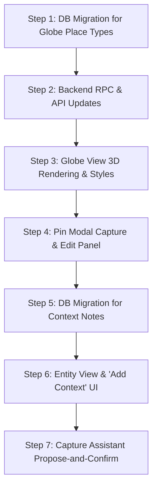

> **Provenance:** Generated by Gemini (Antigravity) in June 2026 as technical commentary on the three June design docs; original at `~/.gemini/antigravity/brain/1fc063eb-…/design_commentary.md`. Copied into the repo 2026-07-18 during the Spine & Share review. Most recommendations were independently built June–July 2026; the still-live items are cited from `docs/plans/2026-07-17-spine-and-share-roadmap.md` §3–§4.

# Compiled Technical Commentary: Life Chronicle Design Plans

This document compiles the comprehensive reviews, technical analyses, and architectural recommendations for the three design plans delivered in June 2026:
1. **Context Layer & the Recollection → Entity Journey** (2026-06-14, Active Spec)
2. **Interview Dialogue → Recollections → Synthesis → Biography** (2026-06-14, Deferred Post-MVP Spec)
3. **Globe Place Types & Temporal Line Language** (2026-06-12, Active Spec)

---

## 1. Context Layer & the Recollection → Entity Journey

### Architectural Strengths
* **Separation of Concerns:** Keeping first-person memories (immutable Raw Vault) separate from third-person background/research (Context) is clean and avoids polluting the sacred voice of the narrator.
* **Entity-Scoped Footnotes:** Attaching context to *entities* rather than memories is highly reusable. A single note about a historical event, military base, or family member automatically frames all recollections referencing that entity.
* **Attribute-Based Visibility:** Using a simple `visibility` attribute on the context notes table accommodates both private owner notes and shareable metadata without needing duplicate table structures or complex RLS rules.

### Detailed Recommendations & Considerations

#### A. Database Schema for `entity_context_notes`
Since `entity_biography` is a derived synthesis (one-row-per-entity), we need a dedicated table for multi-note context. We propose the following SQL schema:

```sql
CREATE TABLE entity_context_notes (
    id            UUID PRIMARY KEY DEFAULT uuid_generate_v4(),
    user_id       UUID NOT NULL REFERENCES auth.users(id) ON DELETE CASCADE,
    entity_id     UUID NOT NULL REFERENCES entities(id) ON DELETE CASCADE,
    body          TEXT NOT NULL,
    source_label  TEXT,
    source_url    TEXT,
    created_by    TEXT NOT NULL CHECK (created_by IN ('owner', 'assistant')),
    visibility    TEXT NOT NULL DEFAULT 'private' CHECK (visibility IN ('shareable', 'private')),
    created_at    TIMESTAMPTZ DEFAULT NOW(),
    updated_at    TIMESTAMPTZ DEFAULT NOW()
);

-- Indexing for fast Entity View rendering
CREATE INDEX idx_entity_context_notes_lookup 
ON entity_context_notes(user_id, entity_id, visibility);
```

#### B. Row-Level Security (RLS) & Access Card Integration
Because private notes are the entity-level equivalent of `memories.private_notes` ("for your eyes only"), we must enforce strict RLS.

> [!CAUTION]
> A note's visibility must be guarded at the database level to ensure that even if an Access Card grants access to the `entity`, the private notes of the owner are never leaked to external readers.

```sql
-- Owner can do anything
CREATE POLICY owner_all_access ON entity_context_notes
    FOR ALL USING (auth.uid() = user_id);

-- Cardholders/contacts can only read SHAREABLE notes of entities they have access to
-- (Assuming a helper function or subquery that verifies entity access via card grants)
CREATE POLICY contact_read_shareable ON entity_context_notes
    FOR SELECT USING (
        visibility = 'shareable' 
        AND exists_entity_card_grant(entity_id, auth.uid())
    );
```

#### C. Entity Merging & Cleanup Protocol
As the entity graph grows, users will inevitably merge duplicate entities (e.g., merging "Zaragoza" and "Zaragoza Air Base"). 
* **Requirement:** The entity merge script or RPC must explicitly migrate all associated `entity_context_notes` from the source entity to the target entity:
  ```sql
  UPDATE entity_context_notes 
  SET entity_id = target_entity_id 
  WHERE entity_id = source_entity_id;
  ```
* Without this, valuable user research and Gemini-extracted context will be orphaned or deleted during graph cleanup.

#### D. Propose-and-Confirm UX Implementation
Replacing the Dismiss-only `memory_elaboration_needed` review cards with context attachment proposals is an excellent UX change.
* **Auto-Extraction of Sources:** When Gemini identifies a context paste (e.g., containing a URL or bibliography text), the assistant should auto-fill `source_label` and `source_url` inside the proposal payload so the user doesn't have to manually format them.
* **Draft States:** The proposed context note should sit in the `review_queue` as a draft proposal until explicitly approved by the user.

---

## 2. Interview Dialogue → Recollections → Synthesis → Biography

### Architectural Strengths
* **Sacred Raw Vault:** The decision to keep verbatim turns in the Raw Vault and place AI narratives in the derived `syntheses` table preserves historical integrity.
* **legibility of Standalone Memories:** Storing the interview question in `metadata.interview_question` makes individual memories fully comprehensible to downstream AI agents without fetching full threads.
* **Hybrid Capture Mode:** Capturing drafts quietly prevents the conversational flow from breaking, addressing a major friction point in voice interactions.

### Detailed Recommendations & Considerations

#### A. Interactive Diff View for Synthesis Propagation
When an underlying memory is revised, related syntheses go stale (`synthesis_stale`). Regenerating these narratives should not happen silently.

> [!TIP]
> Surface an interactive, side-by-side Diff View in the UI when a synthesis is regenerated, highlighting proposed changes. This allows the user to review what the "journalist AI" rewritten and click "Accept Revision" or "Edit Narrative".

| Source Revision | Old Synthesis | Proposed New Synthesis | Action |
| :--- | :--- | :--- | :--- |
| *Original:* I moved in 1974. <br> *Revision:* I moved in **1975**. | "In 1974, he moved to Zaragoza..." | "In **1975**, he moved to Zaragoza..." | `[ Approve Update ]` `[ Edit Draft ]` |

#### B. Bidirectional Session Transcript Linking
The `interview_sessions` table already stores a `transcript` JSONB. We should map specific turns to the extracted `memories`:

```json
// Proposed structure for interview_sessions.transcript
[
  {
    "role": "interviewer",
    "content": "Tell me about your time at the Strategic Air Command in Zaragoza."
  },
  {
    "role": "interviewee",
    "content": "I was assigned to the 16th Air Force there...",
    "extracted_memory_id": "4a7b8c9d-e1f2-3a4b-5c6d-7e8f9a0b1c2d" // Link to Raw Vault
  }
]
```
* This structure allows the UI to render a "Replay Interview Session" screen where clicking on an answer jumps to the corresponding finalized Memory detail page, and vice versa.

#### C. Quiet Capture Hygiene (Preventing Draft Bloat)
Capturing answers "verbatim and quietly" runs the risk of filling the user's review queue with low-quality or half-finished drafts.
* **Session-End Review Modal:** When the session concludes, the assistant should present a cleanup screen: *"Here are 4 recollections I captured from our talk today. Save them to your vault?"*
* This allows the user to bulk-approve, adjust, or discard drafts immediately while the conversation is fresh, preventing backlog build-up.

#### D. Chronological and Logical Consistency Verification
Syntheses often combine multiple memories. If one memory's date is revised (e.g. from 1974 to 1978), simply regenerating the text might produce chronological contradictions if the other joined memories aren't re-sequenced.
* **Agent Context Enrichment:** When triggering the Synthesis Agent to regenerate a stale narrative, the agent must be supplied with the *estimated dates* (`time_estimate`) of all referenced memories to ensure logical temporal ordering.

---

## 3. Globe Place Types & Temporal Line Language

### Architectural Strengths
* **Structured Spatial Anchoring (Model A):** Explicitly linking non-primary pins to a primary residence via `relationships.anchor_residence_id` is clean. It completely bypasses complex date-parsing and temporal-overlap calculations on the frontend while establishing clear visual hierarchy.
* **Residency Spine Isolation:** Preventing vacation and professional travel from corrupting the core chronological spine (`lived_at`) is a vital constraint for the Temporal Agent. It ensures the primary timeline remains robust and linear.
* **Three-Tier Line Hierarchy:** Distinguishing workplace commutes (solid, weightier) from leisure/trips (dashed, lower opacity) adds deep, intuitive legibility to the globe, turning a simple map into a rich narrative visualization.

### Detailed Recommendations & Considerations

#### A. The "Re-Typing Away" Cascade Bug
* **The Problem:** If a user re-types a pin *away* from `lived_at` (e.g., changes a Primary Residence to a Second Residence or Workplace), any marker pins (workplaces, vacations, short-term stays) that were anchored to that residence will now be tethered to a non-primary residence. This breaks the three-tier visual logic, resulting in nested or floating tethers.
* **The DB Constraint Limitation:** The foreign key `ON DELETE SET NULL` only fires when a row is *deleted*, not when its attributes (such as relationship type) are updated.
* **The Solution:** The `update_residence_pin` RPC must explicitly handle this. When a pin's type changes away from `lived_at`, it must orphan its children:
  ```sql
  -- Inside update_residence_pin RPC when p_type_code != 'lived_at':
  UPDATE relationships 
  SET anchor_residence_id = NULL 
  WHERE anchor_residence_id = p_id;
  ```

#### B. Multi-Residence Workplaces (Future-Proofing)
* Instead of allowing a single workplace pin to link to multiple homes, users can create multiple workplace relationship pins representing different employment epochs (e.g., *"Developer at Google (Austin Era)"* anchored to the Austin home, and *"Developer at Google (Seattle Era)"* anchored to the Seattle home). This model fits perfectly with the MVP schema, preserves temporal integrity, and keeps the commute lines accurate over time.

#### C. Multi-Tenancy Anchor Safety
* **Recommendation:** The `create_residence_pin` and `update_residence_pin` RPCs must assert that the user ID of the anchor matches the user ID of the pin being created/updated:
  ```sql
  IF p_anchor_residence_id IS NOT NULL THEN
      IF NOT EXISTS (
          SELECT 1 FROM relationships 
          WHERE id = p_anchor_residence_id AND user_id = p_user_id AND type_code = 'lived_at'
      ) THEN
          RAISE EXCEPTION 'Invalid anchor residence: must belong to the user and be a primary residence.';
      END IF;
  END IF;
  ```

---

## 4. Recommended Implementation Sequencing


